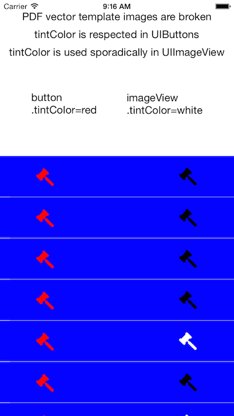

# TemplateImagesBrokenDemo

PDF vector template images are not rendered properly by UIImageView.

## OpenRadar

OpenRadar link for this bug: http://openradar.appspot.com/radar?id=5334033567318016

## Huh?

This example project shows that on iOS8.0 with Xcode 6.01, PDF vector
template images do not work properly with UIImageViews.

A PDF vector image is an image added as a PDF to an Xcode image set,
where the image set's Types attribute has been set to "vectors".

A template image is an image set where the Render As attribtue has
been set to "Template Image".

UIImageView's tintColor documentation says that:

```The default is nil. If a non-nil value is specified, the color is applied to any template images attached to the image view.```

However, as one can see in the screenshot, the tintColor is applied
only sporadically to the UIImageViews on the right of the cell. It is,
however, applied consistently to the UIButtons on the left.

<div style="text-align: center">
</img>
</div>

